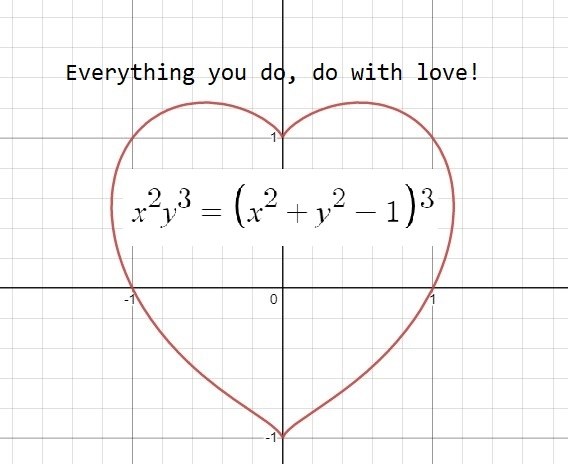

<!-- -->

 

<h1 align="center">Hello 👋, I'm Sandesh Bashyal</h1>
<h3 align="center">♓-Zetahellstar</h3>

  

- 🔭 I’m currently working on [website](project.lichal.com)

- 🔥 Mine Hot Topics: **Reactjs, Django and Web Hosting**

- 💬 Ask me about **Cpanel, Automatic deploy from Github**

- 📫 How to reach me **sandeshbashyal01@gmail.com**

- <kbd onClick="alert('**We both are geniuses🤯**')"> 🤫 Want to know a secret? </kbd>  

<h3 align="left">Connect with me:</h3>

<h3 align="left">Languages and Tools:</h3>

          

<h3 align="left">Support:</h3>

   

&nbsp;

<!--
**SandeshBashyal/SandeshBashyal** is a ✨ _special_ ✨ repository because its `README.md` (this file) appears on your GitHub profile.

Here are some ideas to get you started:

- 🔭 I’m currently working on ...
- 🌱 I’m currently learning ...
- 👯 I’m looking to collaborate on ...
- 🤔 I’m looking for help with ...
- 💬 Ask me about ...
- 📫 How to reach me: ...
- 😄 Pronouns: ...
- ⚡ Fun fact: ...
-->
